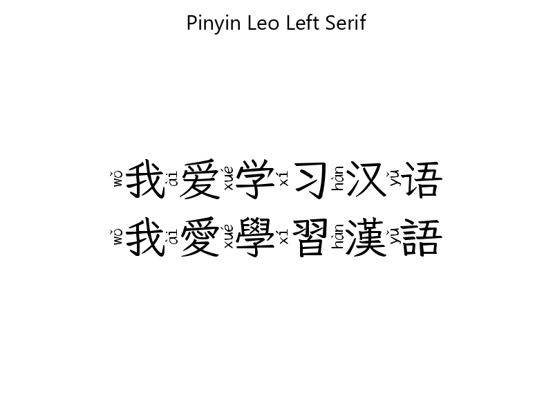
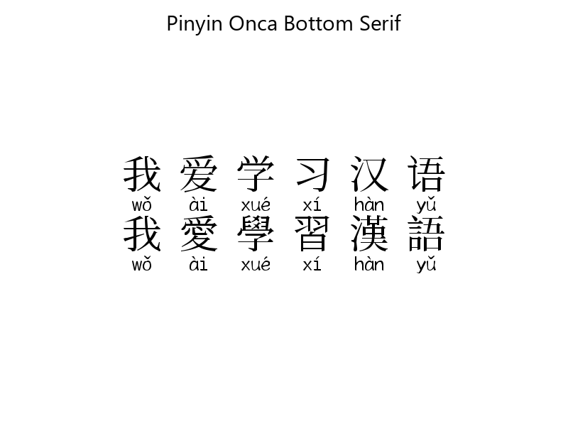

# Ruby Font Creator

Font creator to help students **learn and read foreign languages faster** by appending pronunciation or meaning to each glyph.

# Font Samplers

- This archive contains additional font files used in the samplers: [PinyinFonts.zip](https://github.com/catusf/ruby-font-creator/releases/download/v1.0/PinyinFonts.zip)

### Pinyin-Tigris-Bottom-Handwritten
- **Font file**: [Pinyin-Tigris-Bottom-Handwritten.ttf](output/Pinyin-Tigris-Bottom-Handwritten.ttf)

### Pinyin-Tigris-Left-Handwritten
- **Font file**: [Pinyin-Tigris-Left-Handwritten.ttf](output/Pinyin-Tigris-Left-Handwritten.ttf)

### Pinyin-Tigris-Top-Handwritten
- **Font file**: [Pinyin-Tigris-Top-Handwritten.ttf](output/Pinyin-Tigris-Top-Handwritten.ttf)

### Pinyin-Leo-Bottom-Serif
- **Font file**: [Pinyin-Leo-Bottom-Serif.ttf](output/Pinyin-Leo-Bottom-Serif.ttf)

### Pinyin-Leo-Left-Serif
- **Font file**: [Pinyin-Leo-Left-Serif.ttf](output/Pinyin-Leo-Left-Serif.ttf)

### Pinyin-Leo-Top-Serif
- **Font file**: [Pinyin-Leo-Top-Serif.ttf](output/Pinyin-Leo-Top-Serif.ttf)

### Pinyin-Onca-Bottom-Serif
- **Font file**: [Pinyin-Onca-Bottom-Serif.ttf](output/Pinyin-Onca-Bottom-Serif.ttf)

### Pinyin-Onca-Left-Serif
- **Font file**: [Pinyin-Onca-Left-Serif.ttf](output/Pinyin-Onca-Left-Serif.ttf)

### Pinyin-Onca-Top-Serif
- **Font file**: [Pinyin-Onca-Top-Serif.ttf](output/Pinyin-Onca-Top-Serif.ttf)

### Pinyin-Catus-Bottom-Sans
- **Font file**: [Pinyin-Catus-Bottom-Sans.ttf](output/Pinyin-Catus-Bottom-Sans.ttf)

### Pinyin-Catus-Left-Sans
- **Font file**: [Pinyin-Catus-Left-Sans.ttf](output/Pinyin-Catus-Left-Sans.ttf)

### Pinyin-Catus-Top-Sans
- **Font file**: [Pinyin-Catus-Top-Sans.ttf](output/Pinyin-Catus-Top-Sans.ttf)

### Features

| languages                                                                                |                 preview                  | state | repository                                                               | base-font                                                                                                                                                     |
| ---------------------------------------------------------------------------------------- | :--------------------------------------: | :---: | ------------------------------------------------------------------------ | ------------------------------------------------------------------------------------------------------------------------------------------------------------- |
| Chinese                                                                                  |  | **✔️** | [hanzi-pinyin-font](https://github.com/parlr/hanzi-pinyin-font/releases) | [DroidSansFallbackFull](https://github.com/parlr/platform_frameworks_base/blob/562c45cc841681ed80d4e94515b23c28eb60eae4/data/fonts/DroidSansFallbackFull.ttf) |
| Tifinagh                                                                                 |                    -                     | **🏃‍** | [hanzi-pinyin-font](https://github.com/parlr/tifinagh-font/releases)     | [DroidSansFallbackFull](https://github.com/parlr/platform_frameworks_base/blob/562c45cc841681ed80d4e94515b23c28eb60eae4/data/fonts/DroidSansFallbackFull.ttf) |
| :speaking_head: [request new one](https://github.com/parlr/ruby-font-creator/issues/new) |                    -                     |   -   | -                                                                        | Please provide an open-source font                                                                                                                            |

**Legend:**
**⏸**→
**🏃‍**→
**✔️**

### Install

**Requirements**:  `nodejs`, [`yarn`](http://yarnpkg.com/) or [`npm`](http://npmjs.org/).

	yarn install

### Usage

**Requirements:** a `JSON` file describing _codepoint_-_glyph_-_gloss_ tuple (e.g.  [src/data.json](src/data.json)).

	yarn build

**Custom config:**

	yarn build --config ./src/config/default.js

**Custom data:**

	yarn build --data ./path-to/data.json

**Custom Font Name:**

	yarn build --font-name 'custom-font-name'

:information_source: maintenance tasks available are in the [makefile][./makefile], run `make` to see possible actions.

### Data Structure

A list of objects, each describing a glyph, with the following 3 elements:

1. a unicode `codepoint` ;
1. a base `glyph` ;
1. a `ruby` text.

Example:

	[
	  {
	    "codepoint": "U+03B1",
	    "glyph": "α",
	    "ruby": "alpha"
	  }
	]

### Font

This project use fonts under open-source licenses :
[DejaVuSans](https://github.com/TFTFonts/DejaVuSans),
[DroidSansFallbackFull](https://github.com/parlr/platform_frameworks_base/blob/562c45cc841681ed80d4e94515b23c28eb60eae4/data/fonts/DroidSansFallbackFull.ttf),
[Noto Sans CJK](https://github.com/nodebox/opentype.js/issues/273).

### License

> [Apache License 2.0](http://choosealicense.com/licenses/apache-2.0/)

### Contributors

* [Édouard Lopez](https://github.com/edouard-lopez/) ;
* [Hugo Lopez](https://github.com/hugolpz)
